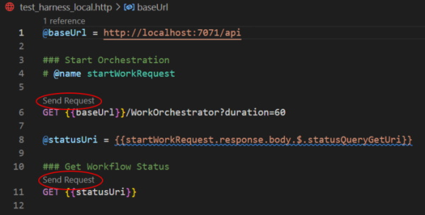

# Running the Application

## Run the Application in VS Code

Use the "test_harness_local.http" or "test_harness_cloud.http" files to run and test the application, clicking on the Send Request above the BaseUrl to start the Orchestrator, and the Send Request above the StatusUrl to check on the workflow execution status.

---

    **NOTE:** In order to use the "test_harness_*.http" files to run and test the application, install the Visual Studio Code extension "Rest Client"
    https://marketplace.visualstudio.com/items?itemName=humao.rest-client

---

## Run the Application with the Utility

The Durable.Tester project in this repository contains a command line utility which can be used to execute the workflows. This utility can be used to test the application locally or in the cloud by specifying different config files with a command line parameter.

For workflows like the user interaction workflow, the utility will prompt the user for inputs received in the SMS message, then send the message back to the proper endpoint in the workflow.
